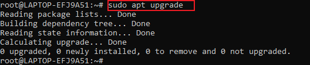
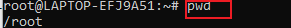
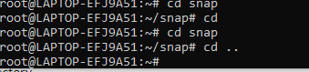
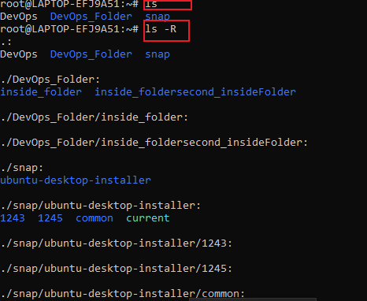
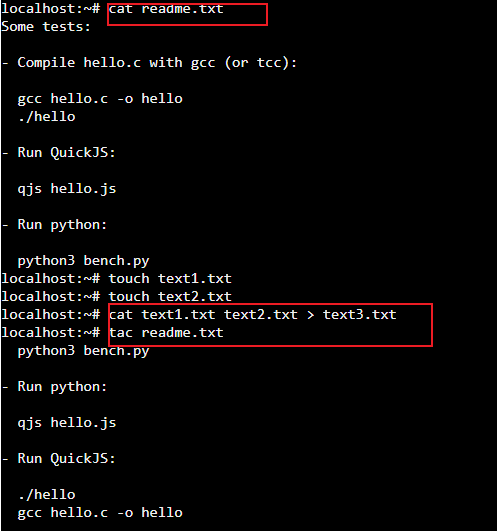

# Linux-practice project

In this project, i will be implementing different linux commands

## Sudo command

sudo mean ` super do `. It allow users to carry out administrative task
eg. `sudo apt upgrade`

## pwd command
 
 `pwd` command is use to find the path of current or present working directory

 

 ## cd command

 it is use to navigate linux files and directories. To change to the home directory, use `cd ~`, `cd /home/ubuntu/CommandLinux`

 

 ## ls command

 ls command list files and directories within a system. Running it without a flag will show the current working directory content

 `ls -R` will show all the files in sub directories

 `ls -a` show hidden files

 

## cat command

Concatenate, lists, combines, and writes file content to the standard output.

`cat text1.txt`

