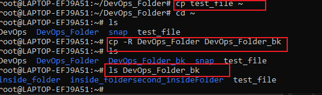
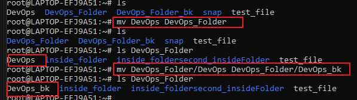
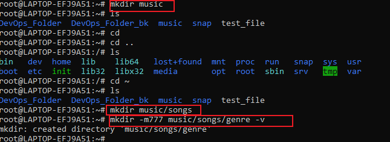
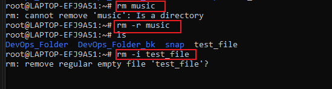
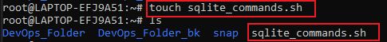
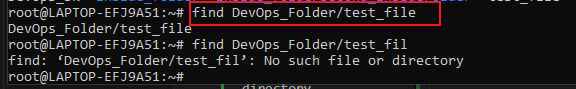
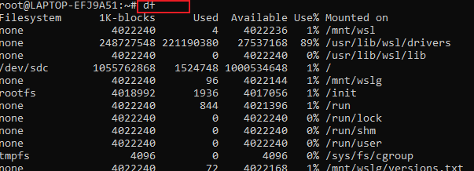
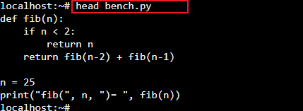
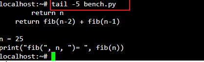

# Linux-practice project

In this project, i will be implementing different linux commands

## Sudo command

sudo mean ` super do `. It allow users to carry out administrative task
eg. `sudo apt upgrade`

## pwd command
 
 `pwd` command is use to find the path of current or present working directory

 

 ## cd command

 it is use to navigate linux files and directories. To change to the home directory, use `cd ~`, `cd /home/ubuntu/CommandLinux`

 

 ## ls command

 ls command list files and directories within a system. Running it without a flag will show the current working directory content

 `ls -R` will show all the files in sub directories

 `ls -a` show hidden files

 

## cat command

Concatenate, lists, combines, and writes file content to the standard output.

`cat text1.txt`

## cp command

`cp` command is use to copy files or directories and its content.

## mv command

`mv` command is primarily for moving files or directories or to rename same

## mkdir command

`mkdir` it use to create one or multiple directories at once and set permissions for each one

## rmdir command

its use to delete files or directory
`-i` prompt system confirmation before deleting a file

`-f` allow delete without confirmation

`-r` deletes files and directories recursively

## touch command

It create an empty file or generate and modify a timestamp in linux command

## locate command

it finds files in the database system

`locate -i shool*note`

## find command

it is use to search for files with a specific directory

`find [option] [path] [expression]`

## grep command

grep is global regular expression print. it finds a word by searching through all the texts in a specific file.

`grep value sql_command.sh`

## df command

`df` report the system's disk space usage, shown in %.

df -h

## head command

this command allows you to view the first 10 lines of a text

`head [option] [file]`

## tail command

the tail command displays the last 10 lines of a file

