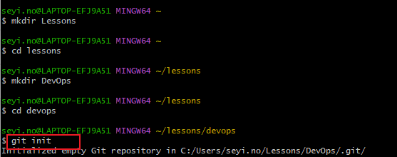

# git-practice project

In this project, i will be implementing basic git commands

## init command
init command is used to initialiaze a git repo. To initialize a git repo, the following steps must be taken
* open a terminal on your computer, eg git bash
* navigate or create a working folder
    * navigate using cd command
    * create a new folder using mkdir
While inside the folder, `run git init `command

## commit command
The commit command is use to save changes. Changes can be adding, modifying or deleting files or text

## branch command
`git branch` helps you create a different copy of your source code. In your new branch, you can make changes as you please. The changes are indipendent of the main copy

## branch listing

use command `git branch` to list the branches on your local repository

## change branch

To change into an existing or old branch use command `git checkout <branch name>`  or `git switch <branch name>`

## merge command

To add the content of two branches together, use `git merge` command

## deleting branch

`git -d <branch name>` is used to delete a branch

## Pushing local git repo to remote github repo

`git remote  `  command lets you create, view, and delete connections to other repositories. Remote connections are more like bookmarks rather than direct links into other repositories. Instead of providing real-time access to another repository, they serve as convenient names that can be used to reference a not-so-convenient URL.

`git remote add <name> <url>` Create a new connection to a remote repository. After adding a remote, you’ll be able to use `＜name＞` as a convenient shortcut for `＜url＞` in other Git commands

## Pushing to Git remotes 

The git push command is used to write to a remote repository

## git status

The `git status` command displays the state of the working directory and the staging area. 

