# LAMP Project
### Linux, Apache, MySQL, PHP

## Linux setup

The setup of the linux os was done on AWS. The OS is  `ubuntu`. Connection to the virtual box is done through SSH

## Installing Apache and updating firewall

Apache HTTP server is the most widely used web server software. It runs on 67% of all webservers in the world

### Install apache using Ubuntu's package `apt`:

`sudo apt update`
`sudo apt install apache2`
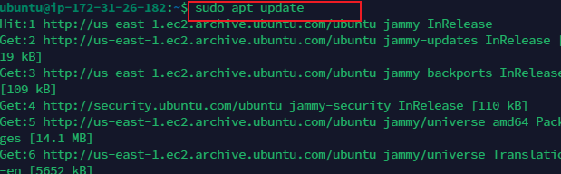

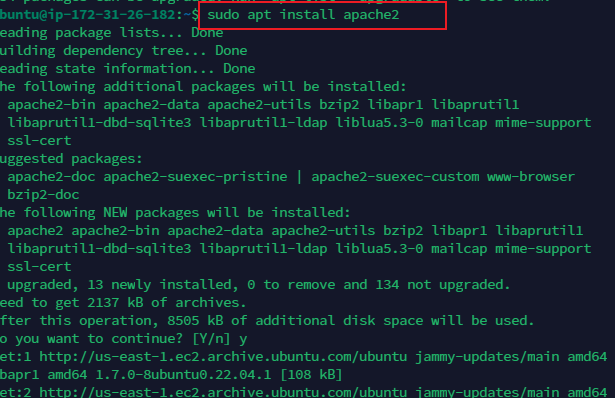

After installation is done, check if apache2 is running, using 
`sudo systemctl status apache2`
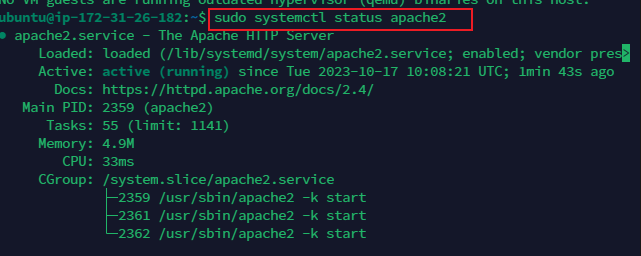

If its green and running, everything is working correctly
 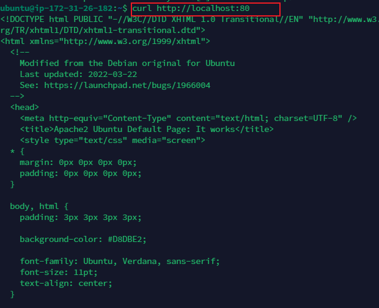

During installation only SSH, port 22 is allowed. To enable http access, port 80 must be open to serve web pages. This is done by opening port 80 on the inbound rule. Once this is done, type the public ip on the browser

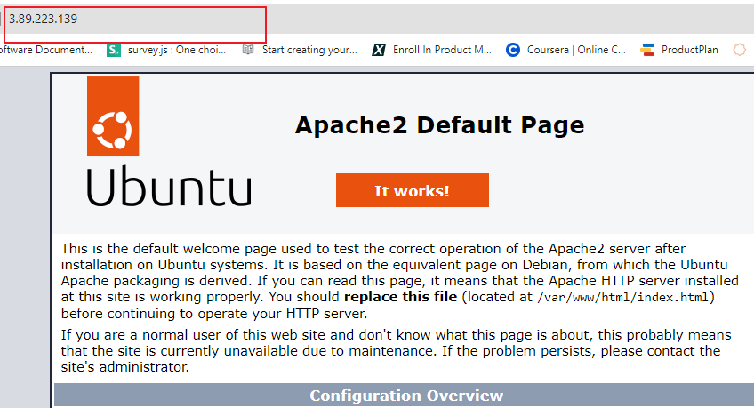

## Installing Mysql

Mysql is a Database Management System (DBMS) to be able to store and manage data for the website.

Use the below command to install mysql-server
`sudo apt install mysql-server`
when prompted, confirm installation by typing Y, then Enter button
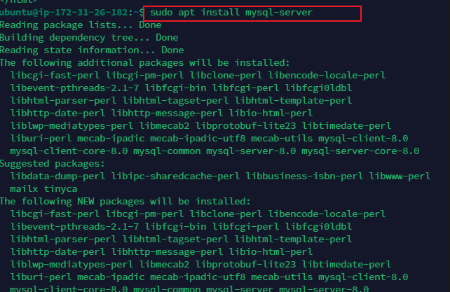

To connect to mysql instance, use `sudo mysql`
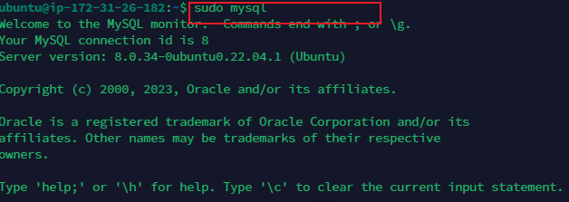

To set a password for the root account, use the below script
`ALTER USER 'root'@'localhost' IDENTIFIED WITH mysql_native_password BY 'PassWord.1';
`
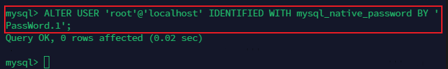

Exit the mysql shell with
mysql> `exit`

To harden the installed sql instance, start the interactive script by running
`$ sudo mysql_secure_installation
`
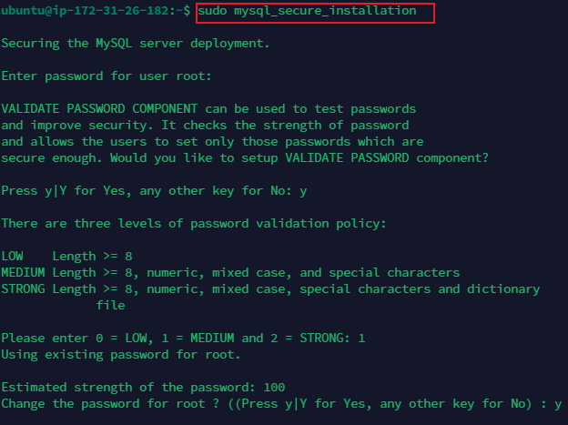

VALIDATE PASSWORD PLUGIN can be used to test passwords
and improve security. It checks the strength of password
and allows the users to set only those passwords which are
secure enough. Would you like to setup VALIDATE PASSWORD plugin?

Press y|Y for Yes, any other key for No:
if you answer "Yes", you'll be asked to select a level of password validation

There are three levels of password validation policy:

LOW    Length >= 8
MEDIUM Length >= 8, numeric, mixed case, and special characters
STRONG Length >= 8, numeric, mixed case, special characters and dictionary              file

Please enter 0 = LOW, 1 = MEDIUM and 2 = STRONG: 1

respond to each prompt as desired.

When you are done test if you can still login to mysql

`$ sudo mysql -p
`
`-p` flag in this command will prompt you for password used after changing the root user password

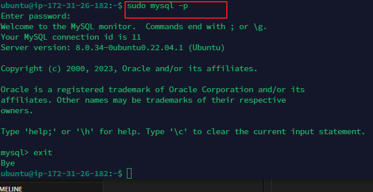

## Installing PHP

PHP is the component of the setup that will process code to display dynamic content to the end user.
We need to install 3 packages, `php, php-mysql, libapache2-mod-php`

`$ sudo apt install php libapache2-mod-php php-mysql
`
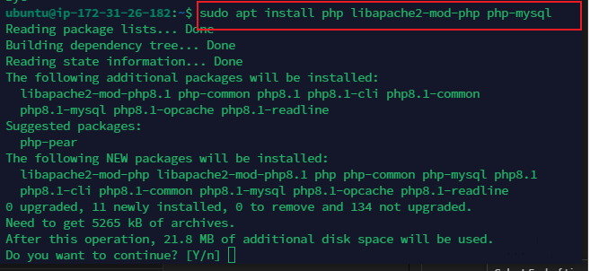

Once installation is finished, you can run the following command to confirm your php version

`php -v`
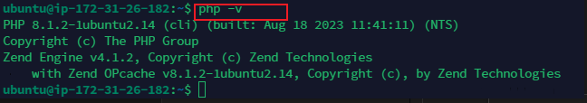

#### Enabling PHP on the website

