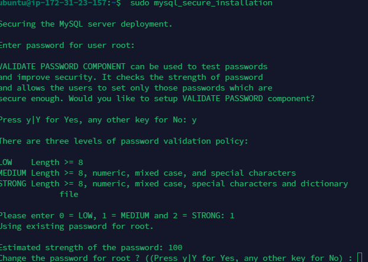

# LEMP Project
### Linux, Nginx, MySQL, PHP

## Linux setup

The setup of the linux os was done on AWS. The OS is  `ubuntu`. Connection to the virtual box is done through SSH

I login to the ubuntu instance on aws using `terminus`

## Installing the Nginx websever

To install Nginx webserver, use the following commands
`sudo apt update`
`sudo apt install nginx`

When prompted, enter Y to confirm that you want to install nginx

To verify installation was successful
`sudo systemctl status nginx`

#### Open port 80
How allow inbound traffic to server web page, port 80 must be open

To check if the web page can be access locally,
`curl http:\\hostname:80`

To test from the browser, use the public ip address

## Installing MySql

MySql is the database management system to store and maintain data for the website

To install, use this command
`sudo apt install mysql-server`

To connect with the sql instance, type `sudo mysql`

To change the root password, type this command
`ALTER USER 'root'@'localhost' IDENTIFIED WITH mysql_native_password BY 'PassWord.1';
`

To harden mysql, run the following interactive script `$ sudo mysql_secure_installation
`

Test connect to mysql with password
`sudo mysql -p`

## Installing PHP
`$ sudo apt install php-fpm php-mysql
`

### Configuring Nginx to use PHP processor

Create the rootweb directory
`$ sudo mkdir /var/www/projectLEMP` and change ownership to current user using variable `$USER`

Create bare-bones configuration using a editor
`$ sudo nano /etc/nginx/sites-available/projectLEMP
`

Activate configuration with the command below
`$ sudo ln -s /etc/nginx/sites-available/projectLEMP /etc/nginx/sites-enabled/
`

Disable default Nginx host which is configure to listen to port 80

`sudo unlink /etc/nginx/sites-enabled/default
`

Create html file in projectLEMP

Reload page

### Test PHP with Nginx

Create a info.php in projectLEMP directory
`$ nano /var/www/projectLEMP/info.php
`

`<?php
phpinfo();
`

php info page contains sensitive information, to remove the page, use
`sudo rm /var/www/your_domain/info.php
`

### Retrieving data from MySql database with PHP

Create new user

create new db

Insert rows to the table

Creating dynamic content through php

Showing database content through php

