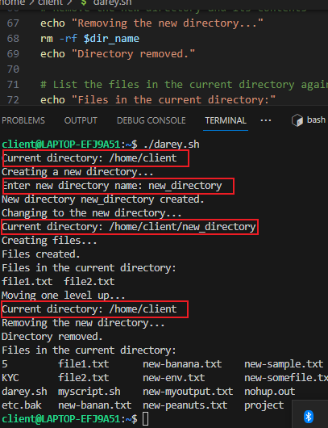
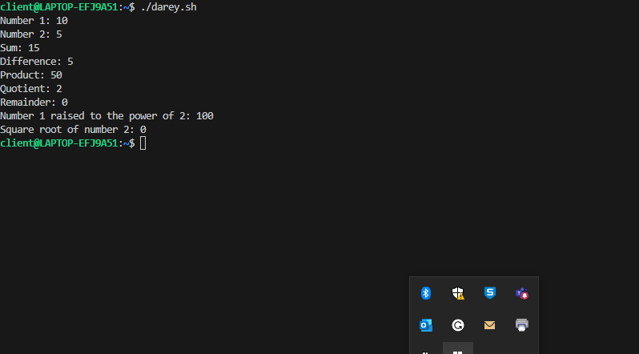

# Shell Scripting
A shell script is a `text file that contains a sequence of commands for a UNIX-based operating system`

## Shell Scripting and user input

A script that accept user input

## Loop
This is iterating over a number

## Directory navigation and Manipulation

the script created a directory, add files and deleted the folder

## File operation and sorting

## Working with number and calculation

this is performing basic arithmetic on variables

output

## Backup

this script backup a folder with date stamp

