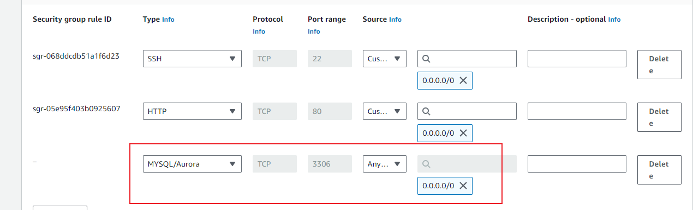

# Client Server Architecture using MySql DB

## Create two instances of servers on Linux

I spin existing server used in LEMP class as the server, while `mysql-client` was setup on my local ubuntu server

 
 

 ## Connect MySql client to MySql server

 `open port 3306`
 

 #### Modify mysql configuration file to accept remote connection

 open `sudo vi /etc/mysql/mysql.conf.d/mysqld.cnf 
` in an editor
change the `bind-address to 0.0.0.0` ie any ip

Restart MySql server to effect the change

#### Connect remotely to MySql server

use this command to connect
mysql -u `<username>` -p -h `<server ip address>`

