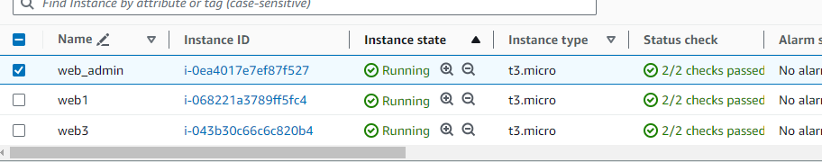
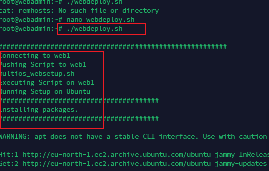
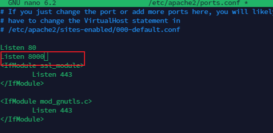
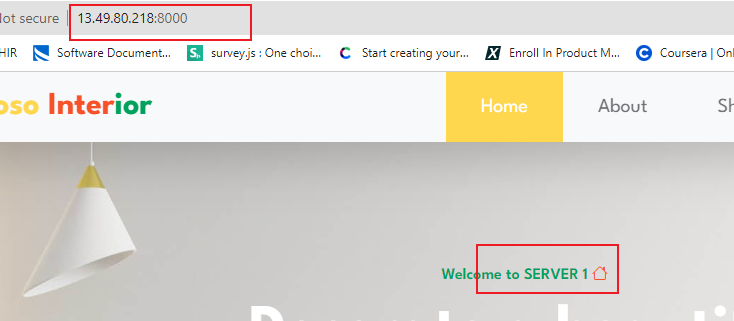
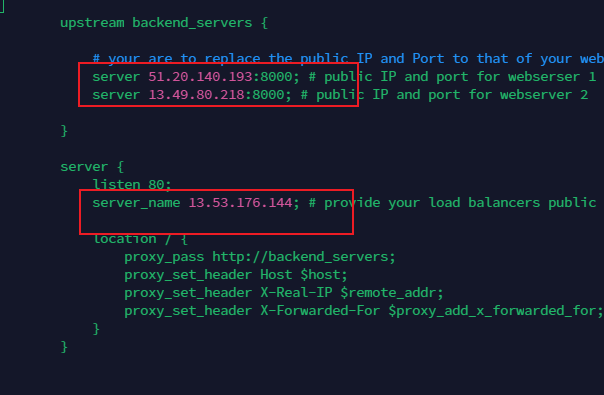
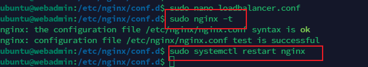

# LOAD BALANCING WITH NGINX

### Create 2 instance of webserver

Using existing server from previous project.

Server is ubuntu with apache2 server while the second server is AWS linux with httpd

The web server are installed using scripts from previous project

the server home page was altered to indicate server 1 and server 2

Opening of `port 8000`

## Install Nginx load balancer

Check installation status

### configure load balancer

Test configuration

### Test loadbalancer on browser

load the load balancer IP on the browser
`13.53.176.144`

