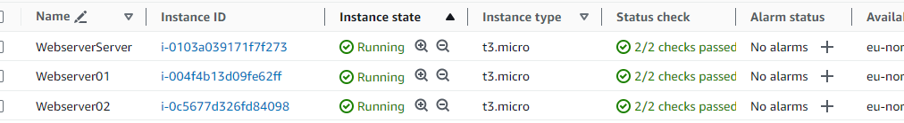
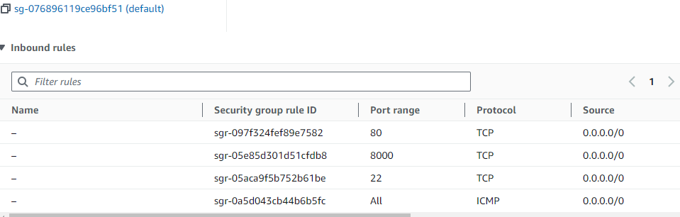
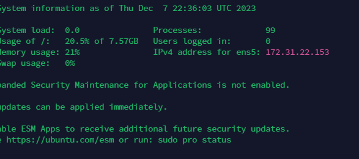
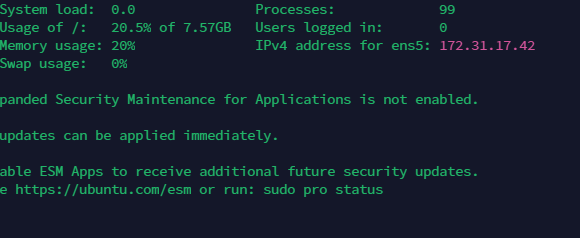
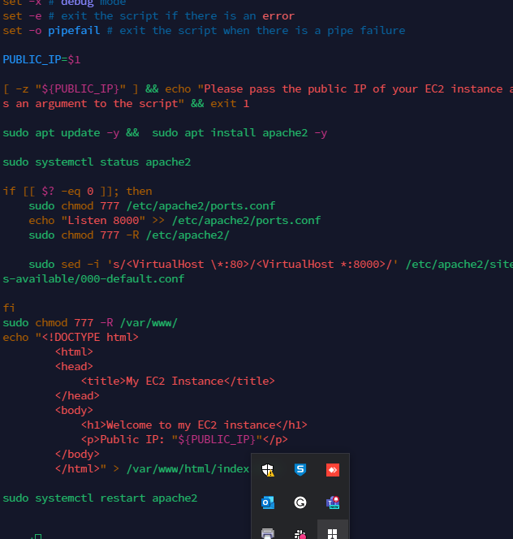
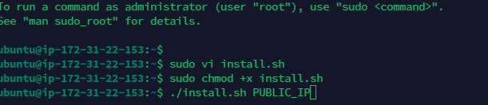
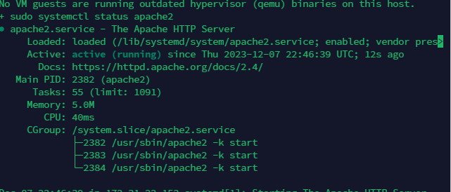
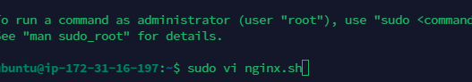
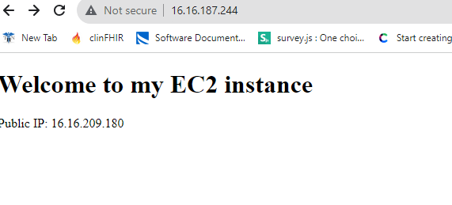
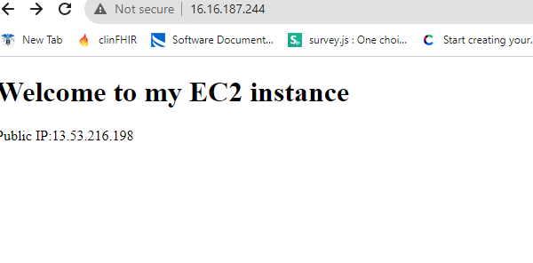

# Automating Loadbalancer configuration with shell scripting

### Automating deployment of webservers

1. create 2 EC2 instance

2. Open port 8000 using the security group

3. ssh to the server to create the script and prepare to execute

server 1

4. open a file, paste the script provided

5. change permission and run the script

*** the public_ip is the public ip of the server

The same process was ran for the 2 server

## Deployment of Nginx as a Load Balancer using shell

1. ssh to the server

2. open a file, paste the provided script

3. grant exec permission to the script file

4. test the script

