## Implementing Wordpress website with LVM Storage management

Implementing wordpress website with LVM storage management on AWS RedHat.  Its a 3-tier setup

1. A laptop as a client
2. EC2 linux server as a webserver
3. EC2 server as a database

### Web Server Setup

1. launch an EC2 instance as a webserver with 3 volumes 

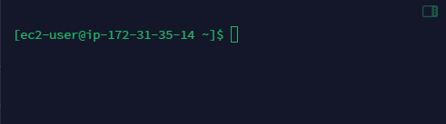

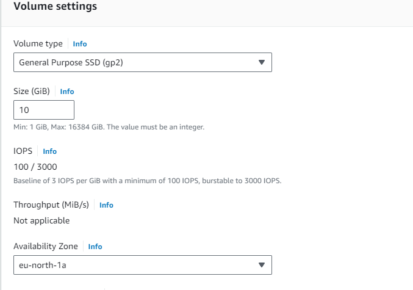

2. Attach volumes to EC2

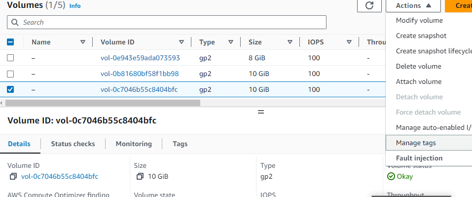

#### Configure the volumes

1. use `lsblk` command to inspect what block devices are attached to the server

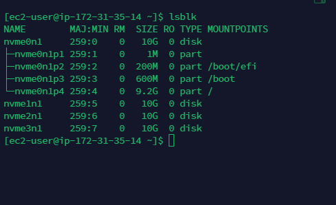

`df -h` to see all mount and free space

2. Disk partition
use `sudo gdisk /dev/xvdf`
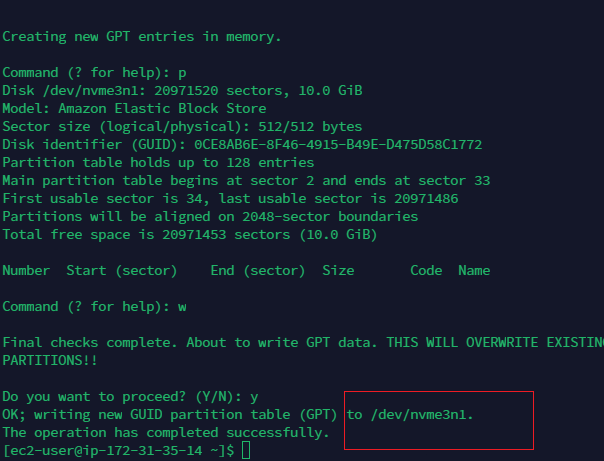

use `lsblk` to view the newly configured partition

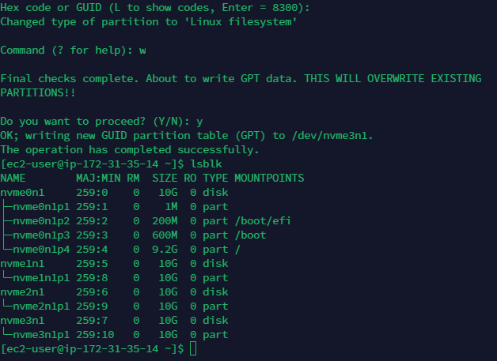

Install logical volume manager  using `sudo yum install lvm2` 

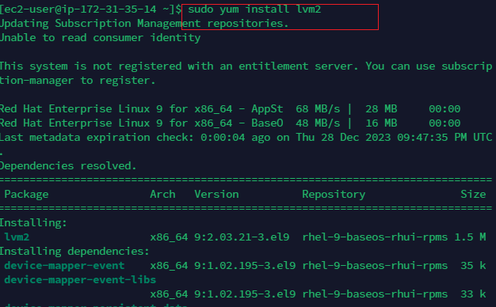

use `pvcreate` to mark the volume as physical volumes

`sudo pvcreate /dev/xvdf1
sudo pvcreate /dev/xvdg1
sudo pvcreate /dev/xvdh1
`

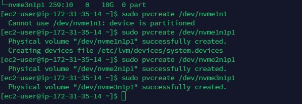

Verify the physical volume is created successfully

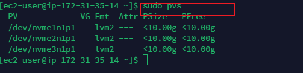

Use `vgcreate` to add the 3 PVs to volume group  - webdata-vg

`sudo vgcreate webdata-vg /dev/xvdh1 /dev/xvdg1 /dev/xvdf1
`
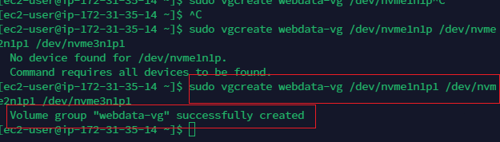

Create 2 logical volume from volume group

`sudo lvcreate -n apps-lv -L 14G webdata-vg
sudo lvcreate -n logs-lv -L 14G webdata-vg`

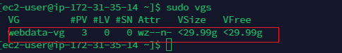

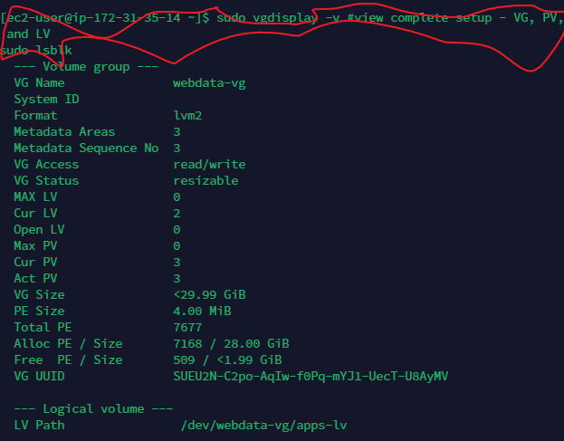
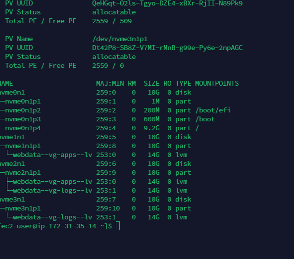

Format the logical volume

`sudo mkfs -t ext4 /dev/webdata-vg/apps-lv
sudo mkfs -t ext4 /dev/webdata-vg/logs-lv
`
Create /var/www/html

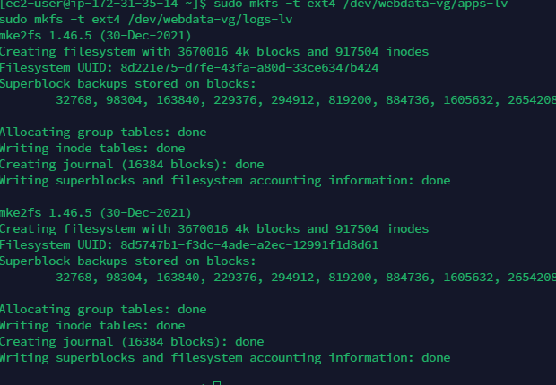

Mount /var/www/html on apps-lv logical volume
`sudo mount /dev/webdata-vg/apps-lv /var/www/html/
`
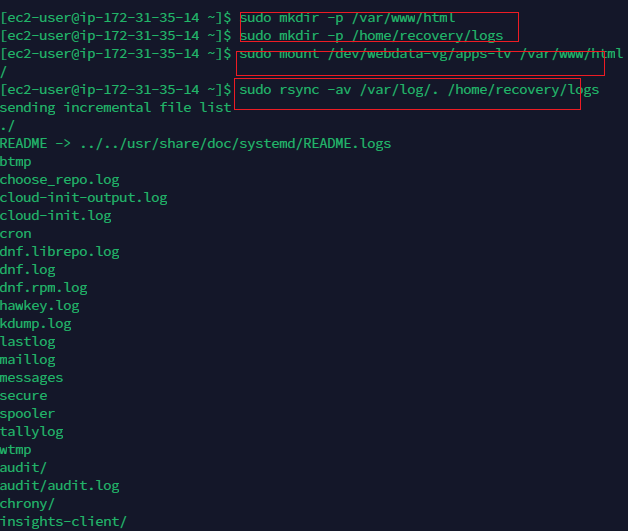

Perform the below command
`sudo rsync -av /var/log/. /home/recovery/logs/
`
`sudo mount /dev/webdata-vg/logs-lv /var/log
`
`sudo rsync -av /home/recovery/logs/log/. /var/log
`
Update /etc/fstab file so that the mount config will persist after restart

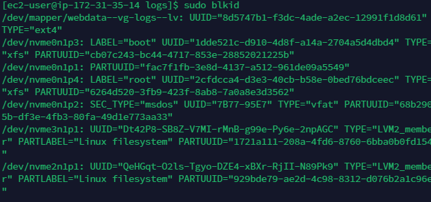

`sudo mount -a
sudo systemctl daemon-reload
`

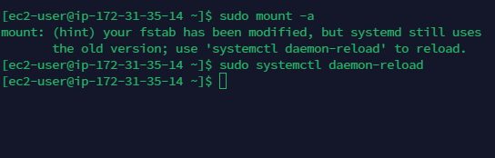

### prepare EC2 instance for Database

The same process as the webserver

I will include the logical volume mount to show that the exercise was performed.

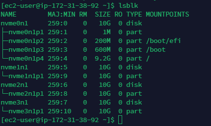

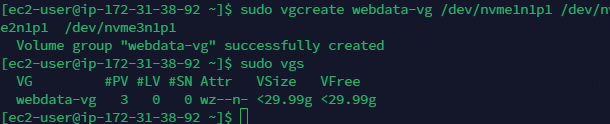

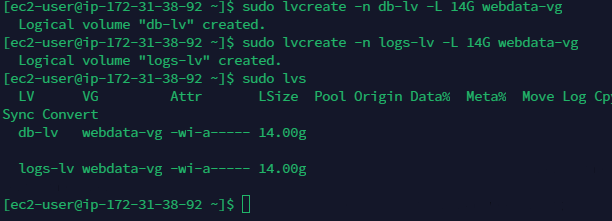

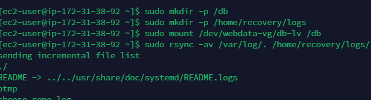

### Install wordpress

Update the repository
`Sudo yum -y update`

Install apache server

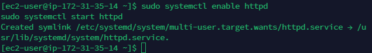

Start apache

`sudo systemctl enable httpd
sudo systemctl start httpd
`
Install PHP dependencies

`sudo yum install https://dl.fedoraproject.org/pub/epel/epel-release-latest-8.noarch.rpm
sudo yum install yum-utils http://rpms.remirepo.net/enterprise/remi-release-8.rpm
sudo yum module list php
sudo yum module reset php
sudo yum module enable php:remi-7.4
sudo yum install php php-opcache php-gd php-curl php-mysqlnd
sudo systemctl start php-fpm
sudo systemctl enable php-fpm
setsebool -P httpd_execmem 1
`
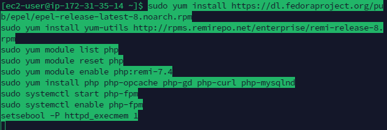

Restart Apache

Download wordpress and copy wordpress to /var/www/html

`mkdir wordpress
cd   wordpress
sudo wget http://wordpress.org/latest.tar.gz
sudo tar xzvf latest.tar.gz
sudo rm -rf latest.tar.gz
cp wordpress/wp-config-sample.php wordpress/wp-config.php
cp -R wordpress /var/www/html/

`
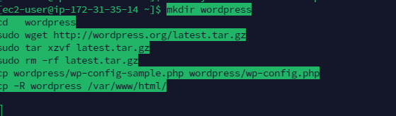

Configure SElinux policies

` sudo chown -R apache:apache /var/www/html/wordpress
 sudo chcon -t httpd_sys_rw_content_t /var/www/html/wordpress -R
 sudo setsebool -P httpd_can_network_connect=1
`

### Install MySQL on the DB server

`sudo yum update
sudo yum install mysql-server
`

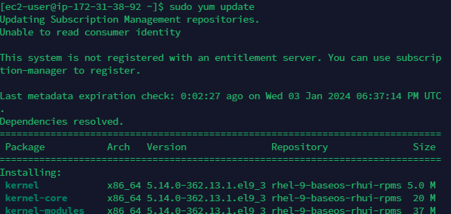

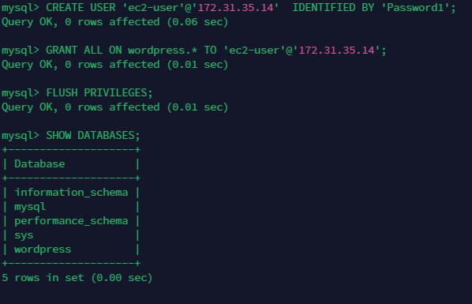

Configure db to work with wordpress

`sudo mysql
CREATE DATABASE wordpress;
CREATE USER `myuser`@`<Web-Server-Private-IP-Address>` IDENTIFIED BY 'mypass';
GRANT ALL ON wordpress.* TO 'myuser'@'<Web-Server-Private-IP-Address>';
FLUSH PRIVILEGES;
SHOW DATABASES;
exit
`

Configure wordpress for remote connection

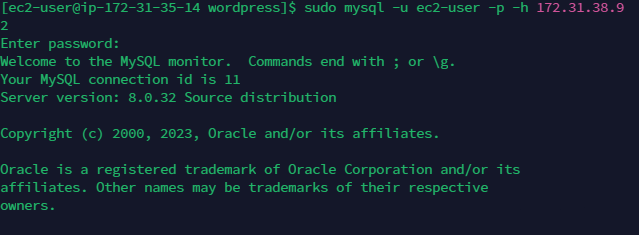

COnfigure db connection on wp-conf
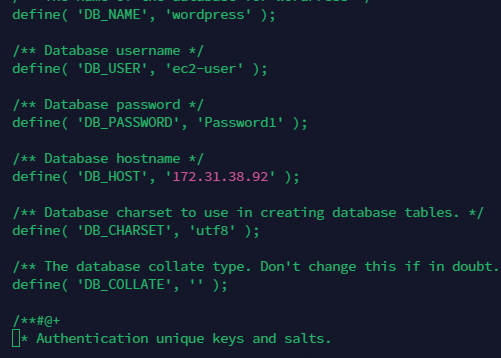

Test db connection with wordpress

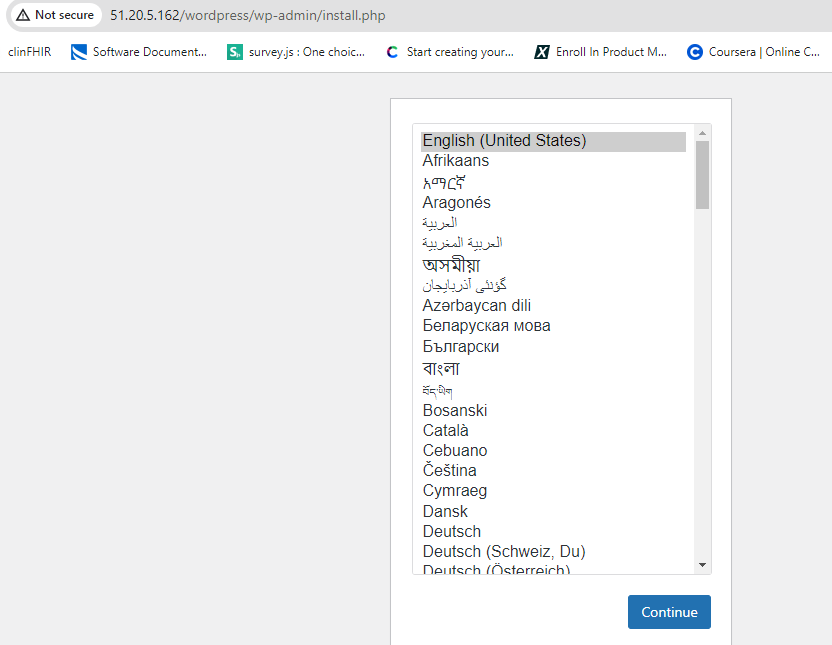

