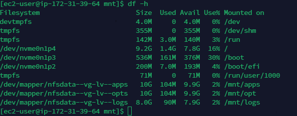
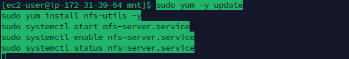

## Implementing a business website using NFS for the backend file storage

1. Spin new EC2 with RHEL linux 9 OS

*** Previous experience LVM (implementing wordpress) was used to prepare the volumes. Limited screen shot taken

Create volume and attach to the NFS server

Partition the block volume using gdisk

Install lvm2

mark the partition volume as physical volumes(PVs)

Add the 3 PVs to a volume group

create 3 logical group
1. lv-apps
2. lv-opt
3. lv-logs

format the logical volumes and mount on /mnt

## Install NFS server

1. install NFS server on the EC2instance with the attched prepared volumes

2. grant permission that will allow the webservers to read, write and execute files

3. configure access to NFS for client within the same subnet

4. configure the export file

5. configure inbound traffic to allow NFS traffic from devices within the subnet

## Install MySQL

1. Install mysql on the NFS server

2. create db name tooling and grant permission to `webaccess` on tooling db

## Webserver

#### Install NFS client
1. spin 2 EC2 instances
2. install nfs client
`sudo yum install nfs-utils nfs4-acl-tools -y
`

3. create a folder `/var/www` and mount it on /mnt/apps
`sudo mkdir /var/www
sudo mount -t nfs -o rw,nosuid <NFS-Server-Private-IP-Address>:/mnt/apps /var/www
`
 

4. persist the mount by modifying the record on `/etc/fstab`
with `<NFS-Server-Private-IP-Address>:/mnt/apps /var/www nfs defaults 0 0
`

#### Install apache and php

1. install `sudo yum install httpd -y

sudo dnf install https://dl.fedoraproject.org/pub/epel/epel-release-latest-8.noarch.rpm

sudo dnf install dnf-utils http://rpms.remirepo.net/enterprise/remi-release-8.rpm

sudo dnf module reset php

sudo dnf module enable php:remi-7.4

sudo dnf install php php-opcache php-gd php-curl php-mysqlnd

sudo systemctl start php-fpm

sudo systemctl enable php-fpm

setsebool -P httpd_execmem 1`

***** the above steps was duplicated on another systen

##### web server 2

webserver1 and 2 have /var/www/ pulling from the same nfs server

Fork the tooling source code from darey.io github account

Open tcp port 80 on the web server

check security permission

Update the db with `tooling-db.sql` script

Update the `functions.php` to connect to the db

Insert a new username to login

Open the `<webserver-url>/index.php, and login with the username: admin , password: admin

