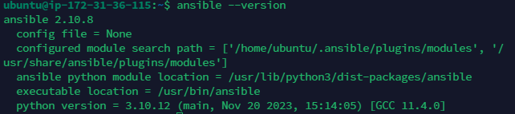
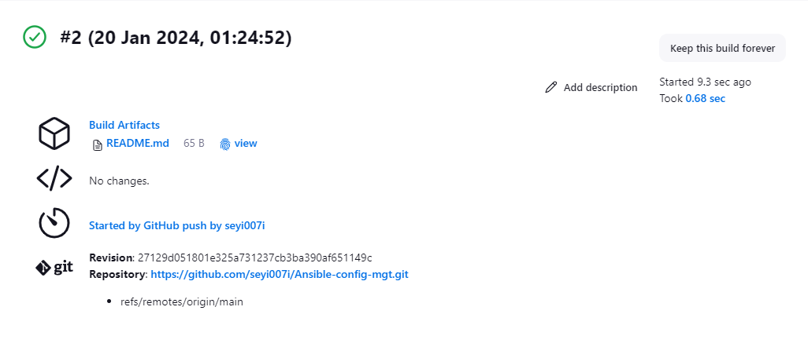
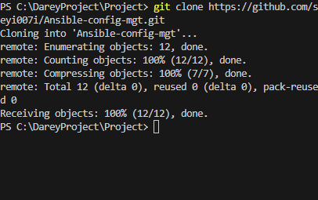
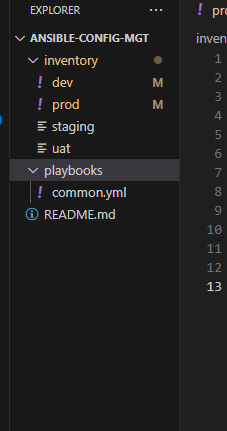
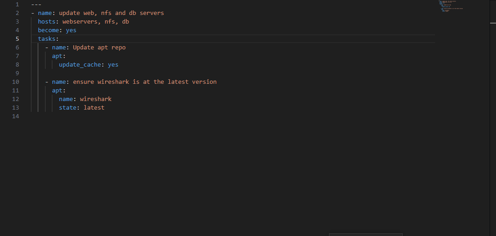
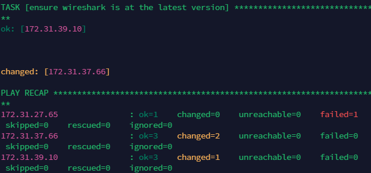
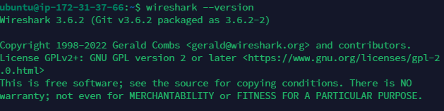

## Ansible Automate Project

### Install and configure ansible on ec2 instance

1. Update the Name tag on the Jenkins EC2 instance to Jenkins-Ansible

2. Create ansible-config-mgt in GitHub 

3. Install Ansible

4. Configure jenkins build job to archive your repository content every time change is made

5. create freestyle project ansible and point it to `ansible-config-mgt` repo 

configure webhook in githut and set webhook to trigger ansible build

Configure a post-build job to save all `**` files

6. Clone the ansible repo on VSCode

7. Create a directory called playbook and inventory
 
create common.yml file in the playbook and dev, stagging, uat and prod into the inventory playbook

8. setup ssh-agent and connect to the jenkins-ansible instance

9. update inventory/dev.yml

10. Create playbooks/common.yml

11. run ansible test

