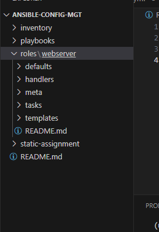

## Ansible refactoring and static assigmnents

Refactoring is a general term in computer programming. it means making changes to the source code without charging expected behaviour of the software

#### Refactor ansible code 

1. make changes to the existing jenkins server

create a new directory called `ansible-config-artifact`

`sudo mkdir /home/ubuntu/ansible-config-artifact`

create new branch on git hub

2. change permissions to the created directory
`chmod -R 0777 /home/ubuntu/ansible-config-artifact`

3 Manage\Available, install `Copy-Artifact`

4. create a new freestyle project

#### Configure uat webservers with a role webserver

1. setup a new directory called roles
2. create other sub folder using `ansible-galaxy init`

or create the folder manually

create the below file structure

copy the below code in the static playbook

Push refactor to github

Unistall the wireshark installed in the previous project

## Configure uat webservers with a role webserver

1. Lunch 2 fresh EC2 instances using RHEL 8 image
web1 and web2

create roles using ansible-galaxy or manually

Update playbook content

run the playbook
cd /home/ubuntu/ansible-config-artifact

ansible-playbook -i /inventory/uat.yml playbooks/site.yaml

