## Ansible dynamic assignments (include) and community roles

### ansible galaxy

Modify the github file structure. Create a new branch `dynamic-assignments`

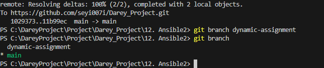

Create a new file `env-vars.yml`

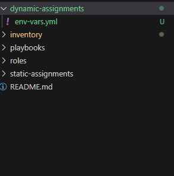

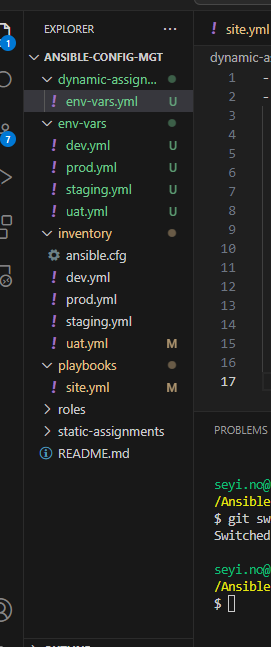

In env-vars.yml,set your code to use `include_vars` variable with loop to iterate over the file for the inventory

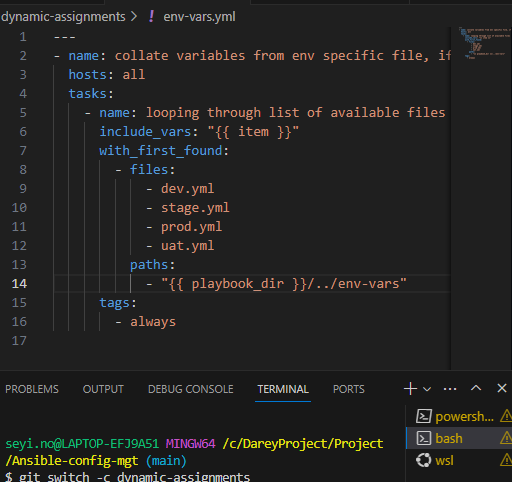

Update site.yml

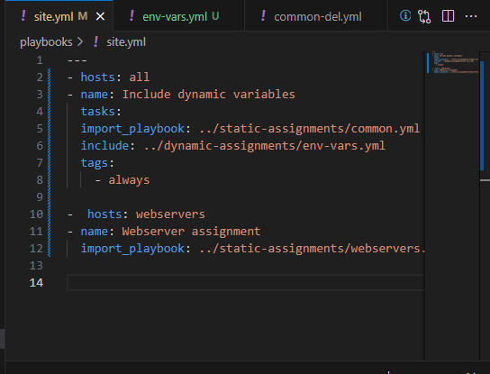

### Update site.yml with dynamic assignments

Roles can be download from ansible galaxy. To download mysql role developed by geerlingguy

create a git hut branch `roles-feature`

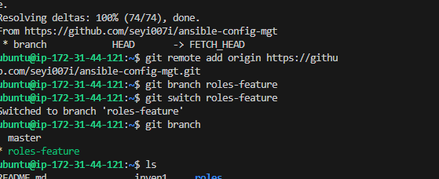

inside roles, directory create the new mysql role with `ansible-galaxy install geerlingguy.mysql` and remane the folder to mysql

Set the configuration to use tooling website credentials

Merge branch with remote master branch

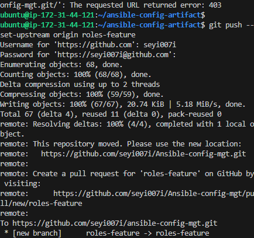
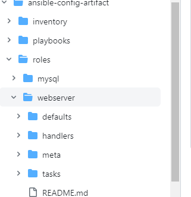

### Setup load balancer

role can also be used to create load balancer. Apache and Nginx will be created

create loadbalancers.yml

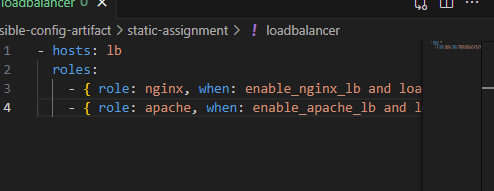

Configure the site.yml to reference the loadbalancer

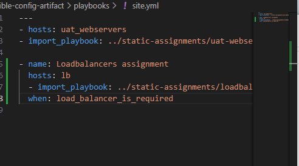

run the playbook

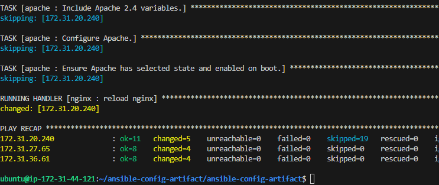

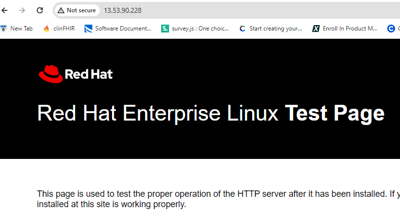

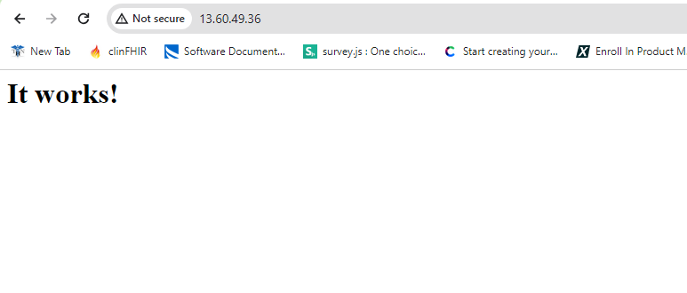

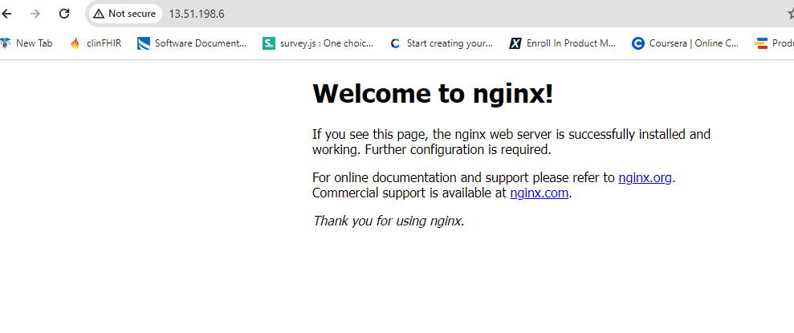
