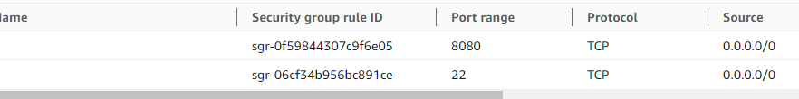
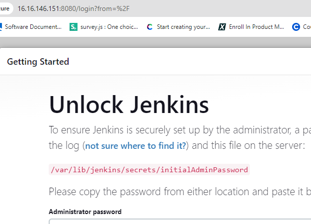
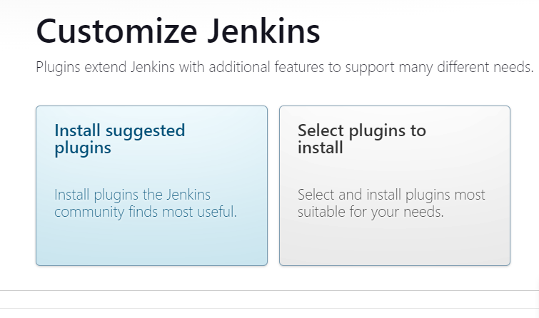
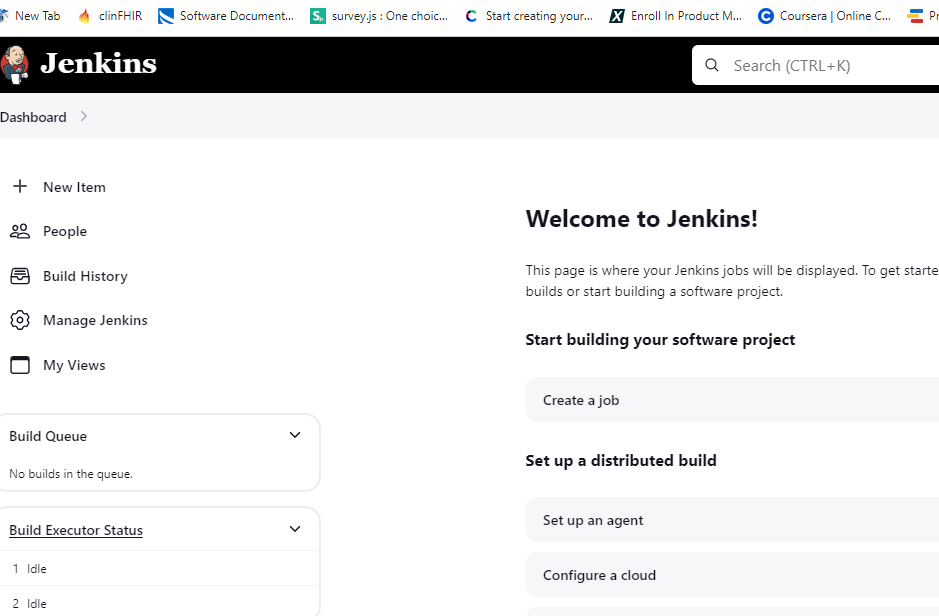
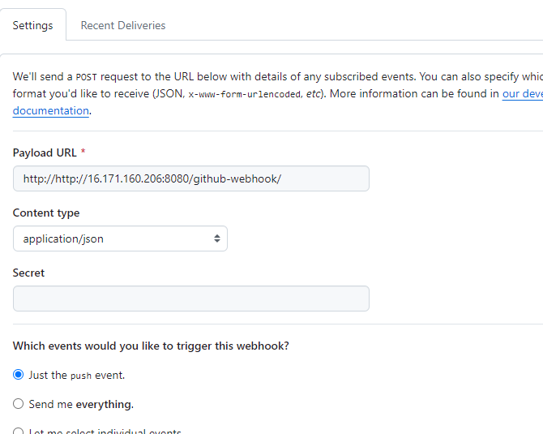
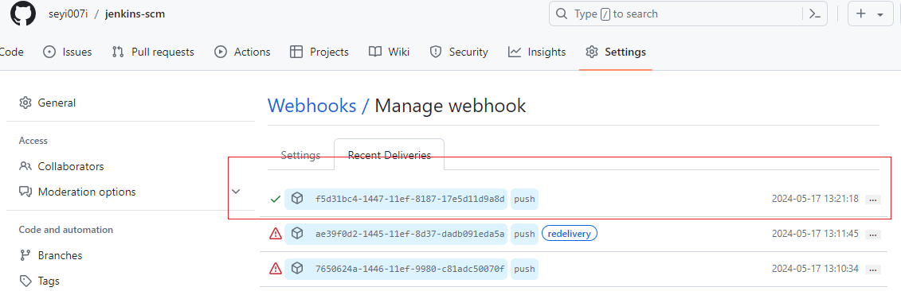
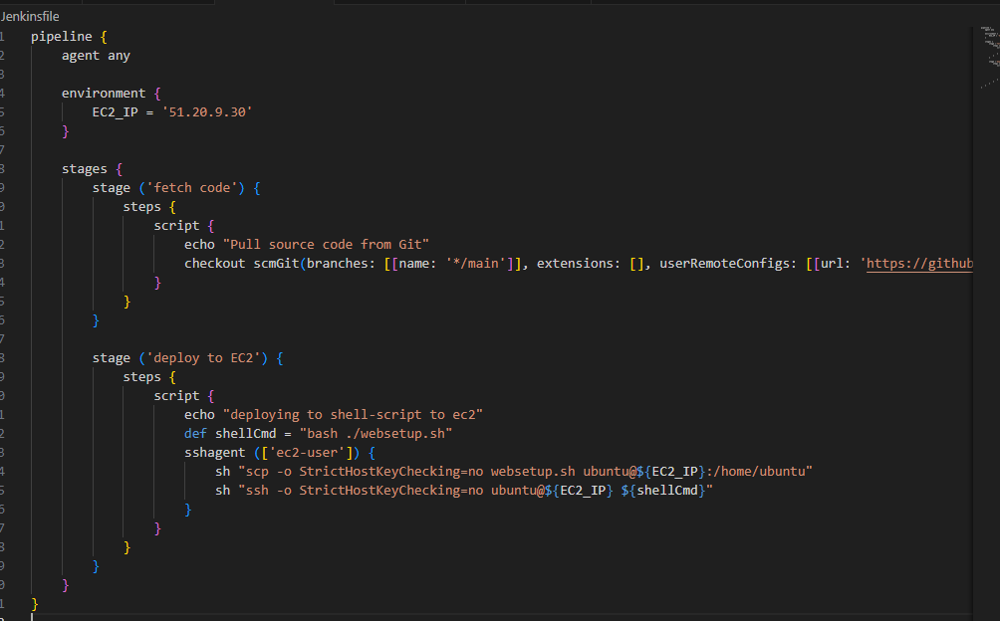
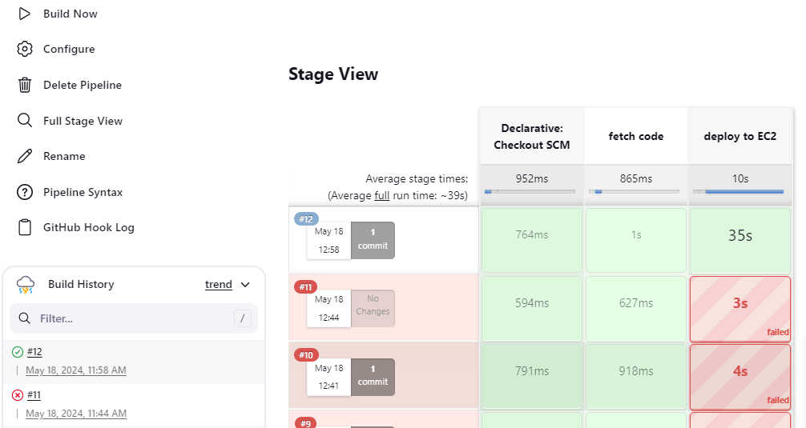
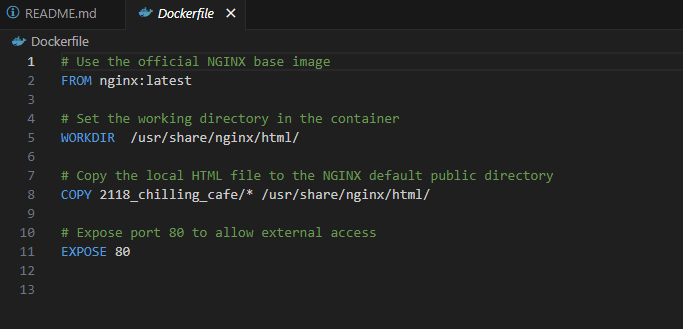
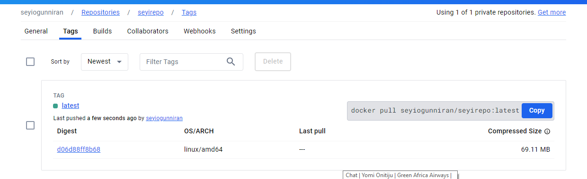

## Introduction to jenkins

#### How to install jenkins

1. setup an EC2 instance on AWS

2. Update the package repositories

`sudo apt update`

3. Install JDK

`sudo apt install default-jdk-headless`

4. install jenkins

sudo wget -O /usr/share/keyrings/jenkins-keyring.asc \
  https://pkg.jenkins.io/debian-stable/jenkins.io-2023.key
echo "deb [signed-by=/usr/share/keyrings/jenkins-keyring.asc]" \
  https://pkg.jenkins.io/debian-stable binary/ | sudo tee \
  /etc/apt/sources.list.d/jenkins.list > /dev/null
sudo apt-get update
sudo apt-get install jenkins

5. check if jenkins has been installed

`sudo systemctl status jenkins`

6. create inbound rule

7. setup the web console

input the jenkins server public ip with the port number on a browser

8. install suggested plugin

9. setup the credentials

10. log in to jenkins console

## 2. Source code Management Repository Integration

- configure webhook with jenkins public IP

This process create a continueous integration `Ci`

packet delivery can also be verified

## 3 Unit test with webhook
Continueous integration is when a code is push from the IDE, the push triggers the Jenkins to an action

1. create a free style project

2. set the repo url

3. check `GitHub hook trigger for GITScm polling` under the build trigger

4. Do a push from the IDE, it will trigger a build. find below the build log 

## 3. jenkins pipeline for web application

1. Create a Jenkinsfile for the build

2. create a `pipeline` project in jenkins

3. Automate the build process using webhook

4. build log

## 5. Docker image creation and registry push

1. Setup a docker Ec2 instance. this can also be done on the Jenkins server

2. Create a dockerfile to create the image

3. create and run jenkins scripts pipeline

4. push to the hub registry

