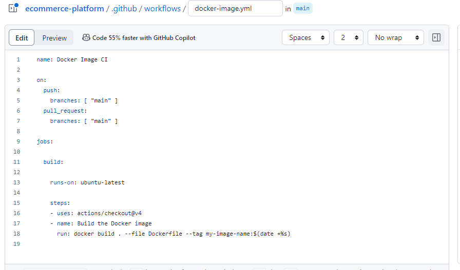

## eCommerce with Github Action

### Project Setup
1. create a git repo `ecommerce-app`

2. Inside the repo, create 2 dir. `api` and `webapp`

### Initialize GitHub Actions

3. Initialize the git repo created
4. Create `.github/workflow` dir in the repo

### backend API setup

5. In the api folder, setup nodejs code

### Frontend web application setup

6. In the webapp folder, setup `react` application

### Continuous Integration workflow

7. Install dependencies, run test and build the appication

### Docker Integration

8. Create Dockerfile for both the api and the front end

9. build docker application

### Deploy to Cloud

10. configure Github action to deploy the docker image

setup secret in the github setting

push the image to docker hub

workflow run

view image on docker hub

Pull the image to Ec2 instance with docker runing

run docker image

